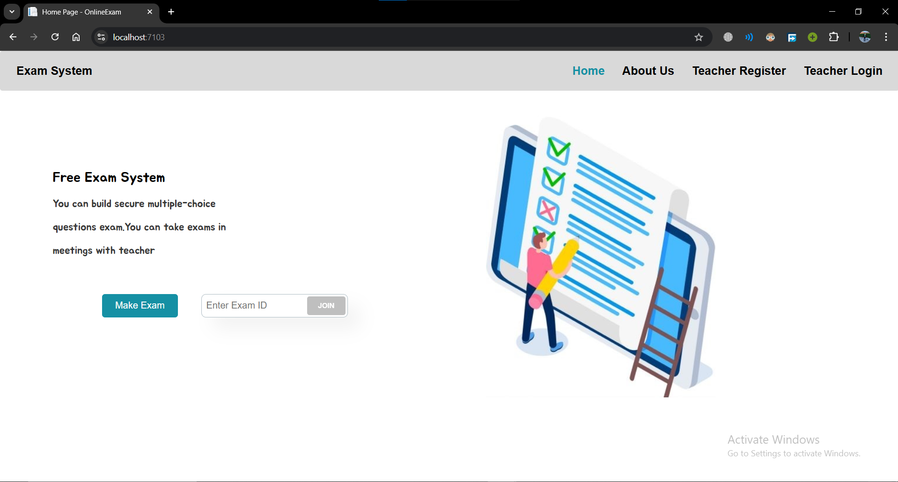
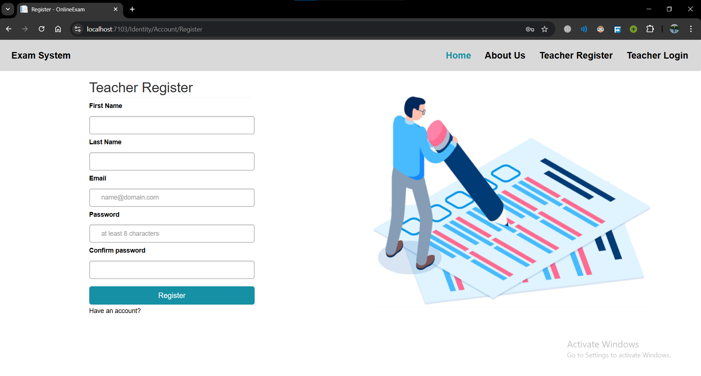
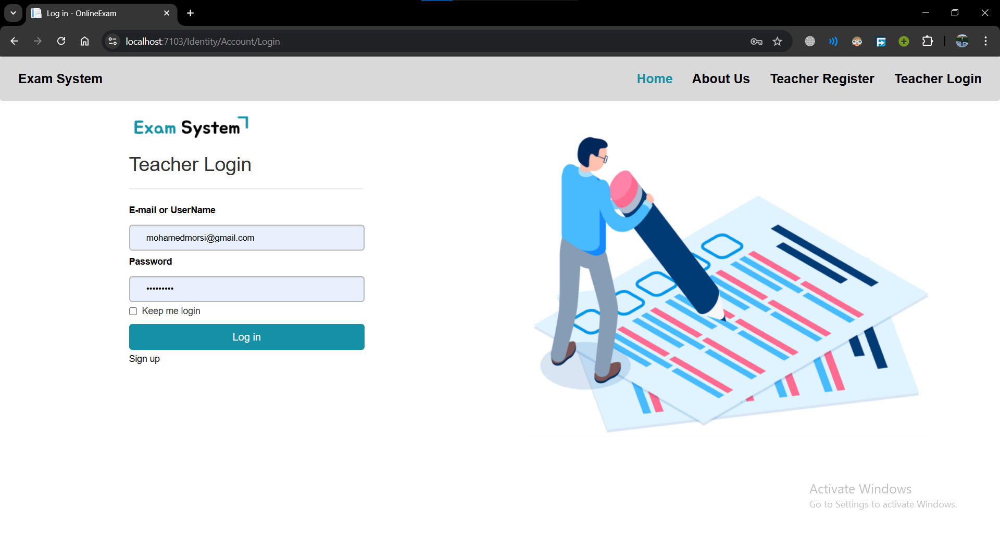
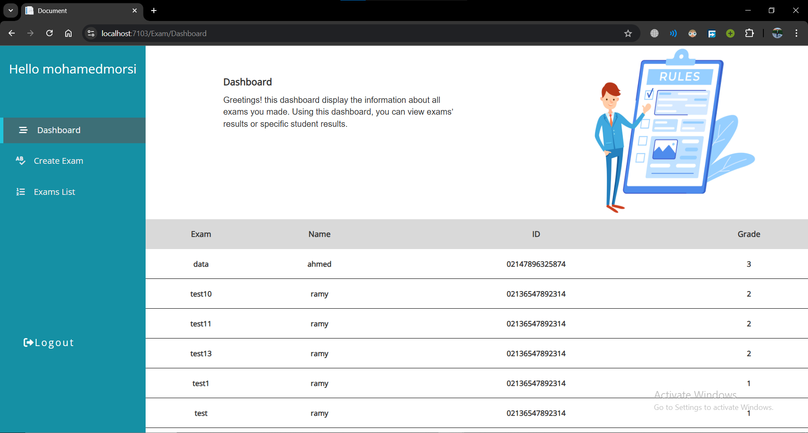
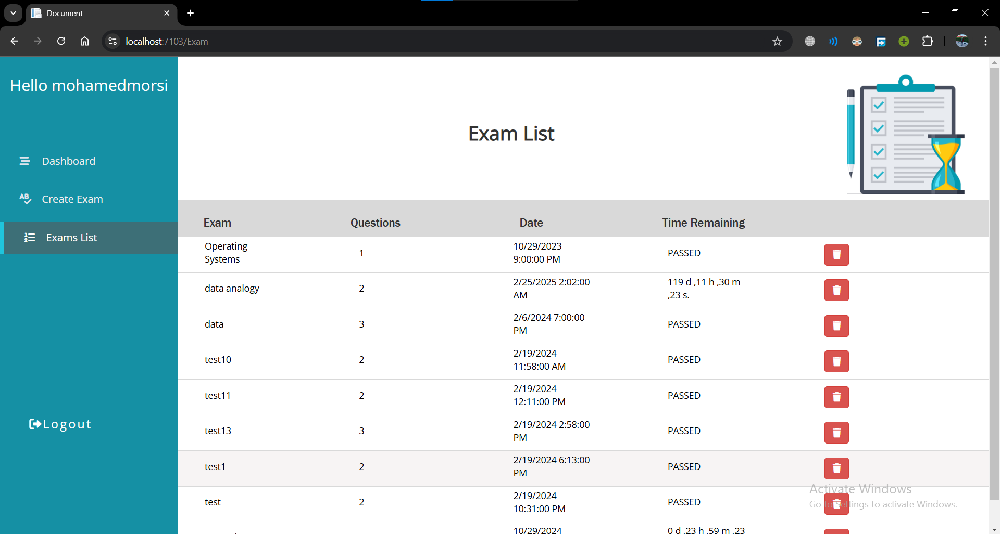
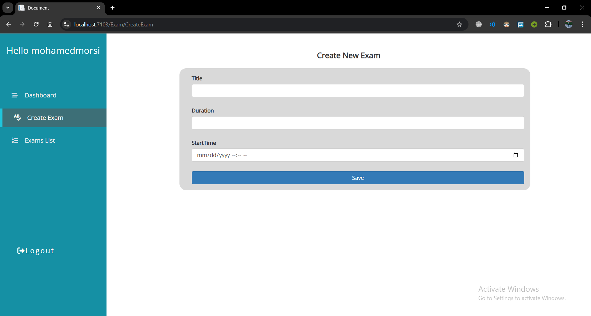
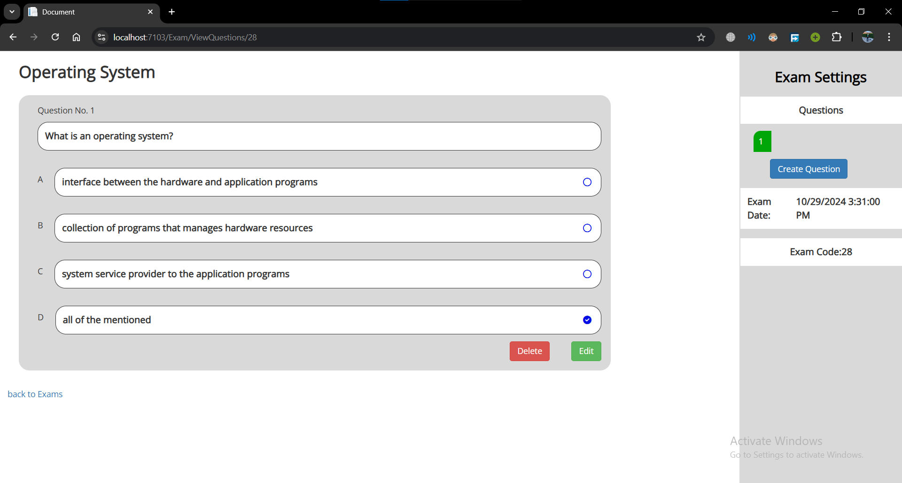
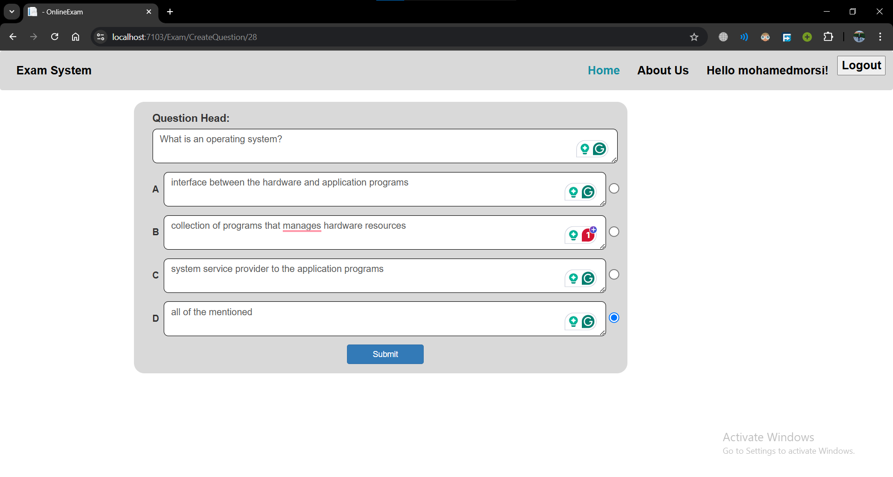

# Student Examination Monitoring System

## Overview

The Student Examination Monitoring System is a web-based platform designed to simplify the exam-taking process for teachers and students. It enables teachers to create, manage, and monitor exams in real-time, ensuring a secure and fair assessment environment for students.

## Features

- **Exam Creation:** Teachers can easily create and manage exams using the platform.
- **Real-time Monitoring:** Students are required to enable their webcam, audio, and screen sharing during the exam, allowing teachers to monitor them in real-time.
- **Instant Feedback:** After completing the exam, students receive immediate feedback on their performance.
- **Multiple Exams Support:** Teachers can create multiple exams and manage them efficiently.

## Technologies Used

- **Frontend:** HTML, CSS, JavaScript, Bootstrap
- **Backend:** ASP.NET MVC (or ASP.NET Core for .NET 6), C#
- **Database:** SQL Server

## Getting Started

### Prerequisites

- [.NET 6 SDK](https://dotnet.microsoft.com/download/dotnet/6.0) installed on your machine
- `[Visual Studio / Visual Studio Code]` or any preferred code editor

## Usage

1. Create a Teacher Account:
    * Log in and create exams.
2. Share Exam Code with Students:
    * Share the unique exam code with your students.
3. Students' Actions:
    * Join the exam, and enable camera, audio, and screen sharing.
4. Real-Time Monitoring:
    * Monitor students in real-time.
5. Instant Feedback:
    * Students receive instant result after completing the exam.

## Application Screenshots
- Here are some screenshots of the application's main pages:

* Home Page :

* Registration Page :

* Login Page :

* DashBoard Page :

* Exam List Page :

* Creating Exam Page :

* Exam Settings Page :

* Adding Question To Exam Page :

## TO Do 
### Here’s a list of features and improvements planned for the application:

* Webcam Integration for Student Monitoring: Enable the webcam feature to allow real-time monitoring of students during exams.

*  Improved User Interface: Enhance the UI for a more intuitive experience.

## Dependencies

- **Microsoft.AspNetCore.Diagnostics.EntityFrameworkCore (v6.0.14):** Provides middleware for Entity Framework Core error pages.
- **Microsoft.AspNetCore.Identity.EntityFrameworkCore (v6.0.16):** Implements ASP.NET Core Identity using Entity Framework Core.
- **Microsoft.AspNetCore.Identity.UI (v6.0.16):** Contains UI components for ASP.NET Core Identity.
- **Microsoft.EntityFrameworkCore.SqlServer (v6.0.16):** Entity Framework Core database provider for SQL Server.
- **Microsoft.EntityFrameworkCore.Tools (v6.0.16):** Provides tools for Entity Framework Core commands.
- **Microsoft.VisualStudio.Web.CodeGeneration.Design (v6.0.13):** Design-time support for ASP.NET Core code generation.

